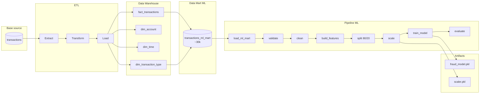

# Schéma du pipeline – Fraud Detection Platform

## Vue d’ensemble

```
┌─────────────────┐     ETL      ┌──────────────────┐    Data Mart     ┌─────────────────────┐    ML Pipeline    ┌──────────────────┐
│  Base source    │─────────────►│ Data Warehouse   │─────────────────►│ transactions_ml_mart│─────────────────►│ Modèle + Scaler   │
│  (transactions) │   Extract    │ (schéma en       │  ~30k lignes     │ (features + label)   │  Entraînement     │ (fraud_model.pkl  │
│  PostgreSQL     │   Transform  │  étoile)        │  fraudes +       │                     │  Évaluation       │  scaler.pkl)      │
│                 │   Load        │                 │  non-fraudes     │                     │                   │                   │
└─────────────────┘              └──────────────────┘                  └─────────────────────┘                  └──────────────────┘
```

---

## 1. Base de données source

| Élément | Description |
|--------|--------------|
| **Type** | PostgreSQL (ex. `source-db` / Docker) |
| **Table** | `transactions` |
| **Rôle** | Données brutes des transactions (step, type, comptes, montants, soldes, is_fraud, etc.) |

---

## 2. Pipeline ETL → Data Warehouse

```
                    ┌─────────────────────────────────────────────────────────────────────────┐
                    │                         ETL (main_etl.py)                                 │
                    └─────────────────────────────────────────────────────────────────────────┘
                                                                    │
    ┌──────────────┐    EXTRACT     ┌──────────────┐   TRANSFORM    ┌─▼──────────────┐   LOAD   ┌──────────────────────┐
    │   Source DB  │──────────────►│  DataFrame   │──────────────►│  DataFrame      │────────►│   Data Warehouse     │
    │  transactions│  extract_     │  (pandas)    │  clean_data   │  standardisé   │  dim_*   │   (PostgreSQL DW)    │
    │              │  transactions  │              │  standardize  │  validé        │  fact_   │                      │
    └──────────────┘                └──────────────┘               └────────────────┘          │  • dim_transaction_  │
                                                                                               │    type              │
                                                                                               │  • dim_account        │
                                                                                               │  • dim_time           │
                                                                                               │  • fact_transactions  │
                                                                                               └──────────┬───────────┘
                                                                                                          │
                                                                                              DATA MART   │
                                                                                              build_ml_   │
                                                                                              mart()      │
                                                                                                          ▼
                                                                                               ┌──────────────────────┐
                                                                                               │ transactions_ml_mart │
                                                                                               │  ~30 000 lignes       │
                                                                                               │  (toutes fraudes +   │
                                                                                               │   échantillon non-   │
                                                                                               │   fraudes)           │
                                                                                               │  Colonnes: amount,    │
                                                                                               │  origin_balance_diff,│
                                                                                               │  dest_balance_diff,  │
                                                                                               │  transaction_type,   │
                                                                                               │  label (is_fraud)    │
                                                                                               └──────────────────────┘
```

---

## 3. Pipeline ML (entraînement)

Les données du data mart sont lues depuis le DW, puis enchaînent préparation, split, scaling, entraînement et sauvegarde des artefacts.

```
    ┌─────────────────────┐
    │ transactions_ml_mart│
    │ (DW, table)         │
    └──────────┬──────────┘
               │ load_ml_mart()
               ▼
    ┌─────────────────────┐     ┌─────────────────────┐     ┌─────────────────────┐
    │ validate_data(df)    │────►│ clean_data(df)      │────►│ build_features(df)  │
    │ (label binaire,      │     │ (doublons, nulls)   │     │ (dummies           │
    │  dataset non vide)   │     │                     │     │  transaction_type) │
    └─────────────────────┘     └─────────────────────┘     └──────────┬──────────┘
                                                                      │
                                                                      │ split_data(df)
                                                                      │ 80 % train / 20 % test
                                                                      │ shuffle + stratify
                                                                      ▼
    ┌─────────────────────────────────────────────────────────────────────────────────────┐
    │  X_train, X_test, y_train, y_test                                                    │
    └─────────────────────────────────────────────────────────────────────────────────────┘
               │
               │ scale_data(X_train, X_test)
               │ fit scaler sur train, transform train + test
               ▼
    ┌─────────────────────┐     ┌─────────────────────┐
    │ train_model(        │     │ evaluate_model(    │
    │   X_train, y_train) │────►│   model, X_test,   │
    │ RandomForest        │     │   y_test)           │
    │ class_weight=       │     │ roc_auc, report     │
    │ balanced             │     │                    │
    └──────────┬──────────┘     └─────────────────────┘
               │
               │ joblib.dump(...)
               ▼
    ┌─────────────────────────────────────────┐
    │  Artifacts                               │
    │  • artifacts/models/fraud_model.pkl      │
    │  • artifacts/scalers/scaler.pkl           │
    └─────────────────────────────────────────┘
```

---

## 4. Récapitulatif des flux

| Étape | Composant | Entrée | Sortie |
|-------|-----------|--------|--------|
| 1 | Source | — | Table `transactions` |
| 2 | ETL Extract | Source DB | DataFrame transactions |
| 3 | ETL Transform | DataFrame | DataFrame nettoyé, standardisé, validé |
| 4 | ETL Load | DataFrame | DW : dim_* + fact_transactions |
| 5 | Data Mart | fact_transactions + dim_transaction_type | Table `transactions_ml_mart` (~30k) |
| 6 | ML Load | DW | DataFrame (transactions_ml_mart) |
| 7 | ML Prepare | DataFrame | DataFrame validé, nettoyé, avec features |
| 8 | ML Split | DataFrame | X_train, X_test, y_train, y_test (80/20, stratifié) |
| 9 | ML Scale | X_train, X_test | X_train_scaled, X_test_scaled, scaler |
| 10 | ML Train | X_train, y_train | Modèle (RandomForest) |
| 11 | ML Evaluate | modèle, X_test, y_test | Métriques (roc_auc, report) |
| 12 | ML Save | modèle, scaler | fraud_model.pkl, scaler.pkl |

---

## 5. Diagramme Mermaid (à afficher dans un lecteur Markdown / GitHub)



Ce fichier décrit le pipeline complet : base source → Data Warehouse → data mart ML → entraînement et artefacts.
